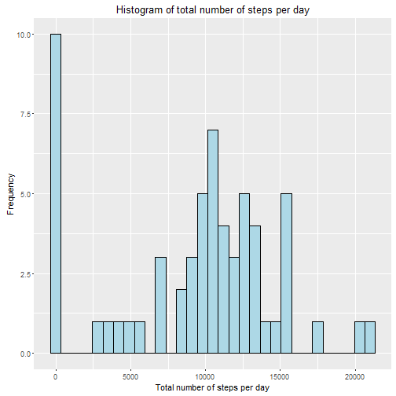
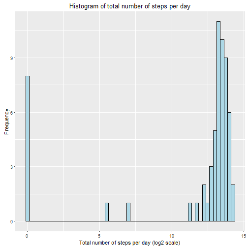
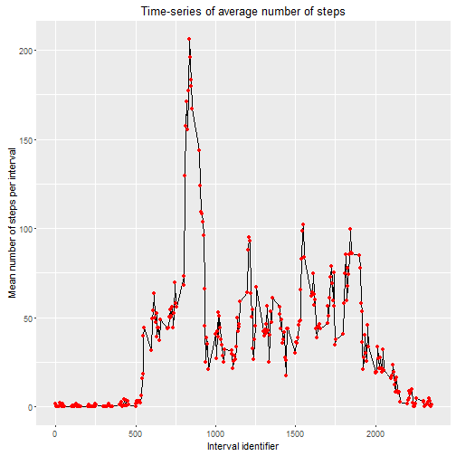
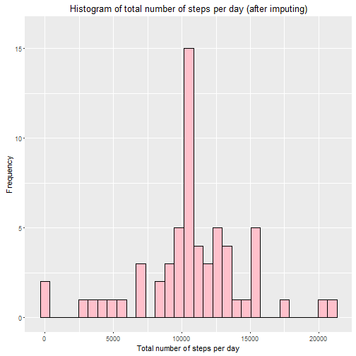
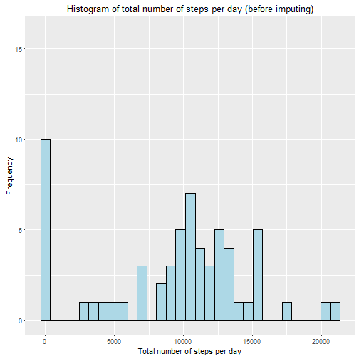
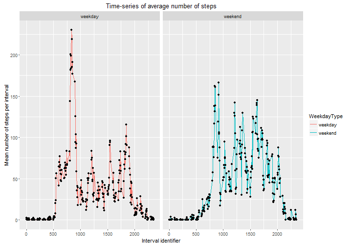

Course Project 1
======================

This document describes analysis of activity monitoring dataset along with code
required for this analysis.    


### 1. Loading and preprocessing data


First, we need to load dataset required for our analysis.


```r
data <- read.csv("activity.csv",header=T,na.strings = NA)
head(data)
```

```
##   steps       date interval
## 1    NA 2012-10-01        0
## 2    NA 2012-10-01        5
## 3    NA 2012-10-01       10
## 4    NA 2012-10-01       15
## 5    NA 2012-10-01       20
## 6    NA 2012-10-01       25
```

```r
dim(data)
```

```
## [1] 17568     3
```

There are 17568 entries in this dataset.

It's also better to transform date variables to Date format. Lubridate package can be used for that.

```r
library(lubridate)
data <- transform(data,date=ymd(date))
```

Now we can proceed to the analysis part.    


### 2. Analysis of total number of steps per day distribution


To summarize total number of steps taken per day dplyr package would be very useful.
To make this analysis faster and more suitable, let's transform dataset to tbl_df format.


```r
library(dplyr)
data_tbl <- tbl_df(data)
class(data_tbl)
```

```
## [1] "tbl_df"     "tbl"        "data.frame"
```

Let's summarize number of steps per day now.


```r
steps_perday <- data_tbl %>% group_by(date) %>% summarise(SumSteps = sum(steps,na.rm=T))
steps_perday
```

```
## Source: local data frame [61 x 2]
## 
##          date SumSteps
##        (date)    (int)
## 1  2012-10-01        0
## 2  2012-10-02      126
## 3  2012-10-03    11352
## 4  2012-10-04    12116
## 5  2012-10-05    13294
## 6  2012-10-06    15420
## 7  2012-10-07    11015
## 8  2012-10-08        0
## 9  2012-10-09    12811
## 10 2012-10-10     9900
## ..        ...      ...
```

We can see that some days have total number of steps equal to 0. This is explained,
mainly, by no measurements in recordings corresponding to some of the days
(e.g., 2012-10-01 recordings have only missing values).


Now let's look at histogram of total number of steps per day distribution.

```r
library(ggplot2)
ggplot(steps_perday,aes(SumSteps))+geom_histogram(binwidth = 700,fill="lightblue",col="black")+
        labs(x="Total number of steps per day",y="Frequency",title="Histogram of total number of steps per day")
```



We see that number of steps per day is widely distributed with a peak at 0. This peak is explained by lack of any measurements
during some days.
Let's look at the same distribution at log scale

```r
ggplot(steps_perday,aes(log2(SumSteps+1)))+geom_histogram(binwidth=0.25,fill="lightblue",col="black")+
        labs(x="Total number of steps per day (log2 scale)",y="Frequency",title="Histogram of total number of steps per day")
```



We see that there is one big wide peak on the right and narrow peak at 0.

Finally, let's calculate the mean and median of the total number of steps taken per day.

```r
mean_steps <- round(with(steps_perday,mean(SumSteps)),2)
median_steps <- with(steps_perday,median(SumSteps))
print(mean_steps)
```

```
## [1] 9354.23
```

```r
print(median_steps)
```

```
## [1] 10395
```

Therefore, mean of total number of steps per day is equal to 9354.23, and median is equal to 10395.        


### 3. Analysis of the average daily activity pattern


Now we will look at data from the other point of view. We will look at average values of steps number
during every 5-minute interval calculated across all measured days. Again, for now we will ignore
missing values.

Let's start from summarizing this statistics.

```r
steps_perinterval <- data_tbl %>% group_by(interval) %>% summarise(MeanSteps = mean(steps,na.rm=T))
steps_perinterval
```

```
## Source: local data frame [288 x 2]
## 
##    interval MeanSteps
##       (int)     (dbl)
## 1         0 1.7169811
## 2         5 0.3396226
## 3        10 0.1320755
## 4        15 0.1509434
## 5        20 0.0754717
## 6        25 2.0943396
## 7        30 0.5283019
## 8        35 0.8679245
## 9        40 0.0000000
## 10       45 1.4716981
## ..      ...       ...
```

```r
dim(steps_perinterval)
```

```
## [1] 288   2
```

There are 288 5-minute intervals. This sums to the whole day that makes perfect sense.

Let's plot dependence of steps number mean on 5-minute interval.


```r
ggplot(steps_perinterval,aes(interval,MeanSteps))+geom_line(col="black")+geom_point(color="red")+
        labs(x="Interval identifier",y="Mean number of steps per interval",title="Time-series of average number of steps")
```



Interval identifier with the maximum number of steps averaged across all days can be found as:

```r
max_meansteps_interval <- steps_perinterval$interval[which.max(steps_perinterval$MeanSteps)]
print(max_meansteps_interval)
```

```
## [1] 835
```

Therefore, interval identifier with maximum number of steps on average is equal to 835.    


### 4. Imputing missing values and recalculating statistics of total number of steps per day

First, we can find number of missing values in our dataset.


```r
number_of_NA <- with(data_tbl, sum(is.na(steps)))
print(number_of_NA)
```

```
## [1] 2304
```

```r
ratio_of_NA <- round(number_of_NA/nrow(data_tbl)*100,2)
print(ratio_of_NA)
```

```
## [1] 13.11
```

Thus, there are 2304 missing values in our dataset. They correspond to 13.11% of values.
This is pretty big number.

Therefore, we should impute missing values. As we saw pretty big dispersion among different intervals,
let's impute missing values with the mean calculated for corresponding interval.


```r
data_noNAs <- data_tbl
data_noNAs$steps[is.na(data_noNAs$steps)] <- tapply(data_noNAs$steps,data_noNAs$interval,mean,na.rm=T)[as.character(data_noNAs$interval[is.na(data_noNAs$steps)])]
print(sum(is.na(data_noNAs)))
```

```
## [1] 0
```

There are no missing values now.

Let's summarize number of steps per day for this, imputed, dataset.


```r
steps_perday_noNA <- data_noNAs %>% group_by(date) %>% summarise(SumSteps = sum(steps,na.rm=T))
steps_perday_noNA
```

```
## Source: local data frame [61 x 2]
## 
##          date SumSteps
##        (date)    (dbl)
## 1  2012-10-01 10766.19
## 2  2012-10-02   126.00
## 3  2012-10-03 11352.00
## 4  2012-10-04 12116.00
## 5  2012-10-05 13294.00
## 6  2012-10-06 15420.00
## 7  2012-10-07 11015.00
## 8  2012-10-08 10766.19
## 9  2012-10-09 12811.00
## 10 2012-10-10  9900.00
## ..        ...      ...
```

Now we can look at histogram of this statistics and compare it to histogram of the same statitics summarized
for dataset with missing values.


```r
ggplot(steps_perday_noNA,aes(SumSteps))+geom_histogram(binwidth = 700,fill="pink",col="black")+
        coord_cartesian(ylim=c(0,16))+
        labs(x="Total number of steps per day",y="Frequency",title="Histogram of total number of steps per day (after imputing)")
```



Let's look at previous histogram again (when missing values were present):

```r
ggplot(steps_perday,aes(SumSteps))+geom_histogram(binwidth = 700,fill="lightblue",col="black")+
        coord_cartesian(ylim=c(0,16))+
        labs(x="Total number of steps per day",y="Frequency",title="Histogram of total number of steps per day (before imputing)")
```



We can see that histograms are almost the same. The only difference is that peak of zeros from initial dataset moved
to the peak at 10500 total number of steps per day in new dataset. This is explained by the fact that many days have only missing values. After imputing all of them were filled with some mean values.

Now let's calculate the mean and median of the total number of steps taken per day for imputed dataset.

```r
mean_steps_new <- round(with(steps_perday_noNA,mean(SumSteps)),2)
median_steps_new <- with(steps_perday_noNA,median(SumSteps))
print(mean_steps_new)
```

```
## [1] 10766.19
```

```r
print(median_steps_new)
```

```
## [1] 10766.19
```

New values of mean and median are equal to 1.076619 &times; 10<sup>4</sup> and 1.0766189 &times; 10<sup>4</sup>, correspondingly.
Same statistics calculated before imputing were equal to 9354.23 and 10395, correspondingly.
We see that new values are bigger than old ones. This is explained by the fact that previously equal to zero days (old narrow peak at 0 on histogram) now have total number of steps equal to 10766.19. These days corresopnd both to mean and median in new, imputed, dataset.    


### 5. Looking at differences between weekdays and weekends

Let's add new factor variable to our dataset specifying if corresponding day is weekday or weekend.


```r
data_noNAs <- mutate(data_noNAs,WeekdayType=ifelse(weekdays(data_noNAs$date)=="Sunday" | weekdays(data_noNAs$date)=="Saturday","weekend","weekday"))
head(data_noNAs)
```

```
## Source: local data frame [6 x 4]
## 
##       steps       date interval WeekdayType
##       (dbl)     (date)    (int)       (chr)
## 1 1.7169811 2012-10-01        0     weekday
## 2 0.3396226 2012-10-01        5     weekday
## 3 0.1320755 2012-10-01       10     weekday
## 4 0.1509434 2012-10-01       15     weekday
## 5 0.0754717 2012-10-01       20     weekday
## 6 2.0943396 2012-10-01       25     weekday
```

Now let's get average number of steps per interval separately for weekends and weekdays.


```r
steps_perinterval_weekday <- data_noNAs %>% group_by(interval,WeekdayType) %>% summarise(MeanSteps = mean(steps,na.rm=T))
steps_perinterval_weekday
```

```
## Source: local data frame [576 x 3]
## Groups: interval [?]
## 
##    interval WeekdayType   MeanSteps
##       (int)       (chr)       (dbl)
## 1         0     weekday 2.251153040
## 2         0     weekend 0.214622642
## 3         5     weekday 0.445283019
## 4         5     weekend 0.042452830
## 5        10     weekday 0.173165618
## 6        10     weekend 0.016509434
## 7        15     weekday 0.197903564
## 8        15     weekend 0.018867925
## 9        20     weekday 0.098951782
## 10       20     weekend 0.009433962
## ..      ...         ...         ...
```

```r
dim(steps_perinterval_weekday)
```

```
## [1] 576   3
```

Let's look at time-series of mean number of steps per interval separately for weekends and weekdays.;


```r
ggplot(steps_perinterval_weekday,aes(interval,MeanSteps,color=WeekdayType))+geom_line()+
        geom_point(color="black")+facet_grid(.~WeekdayType)+
        labs(x="Interval identifier",y="Mean number of steps per interval",title="Time-series of average number of steps")
```



Variance of average number of steps per interval during weekend is much bigger compared to weekdays.
However, the maximum mean number of steps per interval is observed on weekdays data (more than 225 steps per 5-minute interval).
